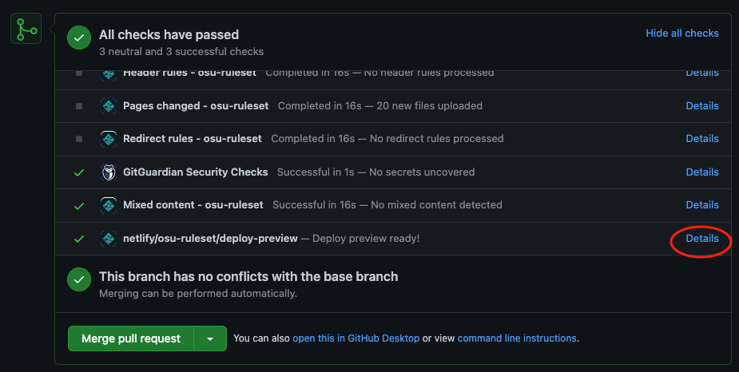

# Contributing Guidelines

Thank you for showing interest in the development of Rūrusetto. This guidelines below is a guidelines. There are not "official rules" or something like that, but following them will help everyone deal with things in the most efficient manner.

## Table of contents

- [Contributing Guidelines](#contributing-guidelines)
  - [Table of contents](#table-of-contents)
  - [I would like to submit an issue!](#i-would-like-to-submit-an-issue)
  - [I would like to submit a pull request!](#i-would-like-to-submit-a-pull-request)
    - [I am web developer!](#i-am-web-developer)
    - [I don't have any programming knowledge but I want to contribute!](#i-dont-have-any-programming-knowledge-but-i-want-to-contribute)
      - [Markdown](#markdown)
      - [Git and GitHub](#git-and-github)
      - [Start making a new pages](#start-making-a-new-pages)
      - [Want to see what's look like in a website?](#want-to-see-whats-look-like-in-a-website)

## I would like to submit an issue!

Typo in wiki, bug reports and feature suggestion are welcomed. Or you are a developer that make a new osu! ruleset and it's not appear in this website you can submit an issue too!

## I would like to submit a pull request!

You can contribute this website in many ways! So it's have 2 big ways. Before we go longer, here is some key things before get started.

* **Make sure to keep the *Allow edits from maintainers* check box checked.**
  To speed up the merging process, sometimes collaborators want to push some change to your pull request. So, having the *Allow edits from maintainers* checkbox checked lets maintainers do that; without it maintainers are forced to report issues back to you and wait for you to address them.

* **Refrain from continually merging the main branch back to the pull request.**
  Please refrain from continually merging the `main` branch unless there are merge conflicts that need resolution. One of the maintainers will merge `main` branch themselves before merging the pull request itself anyway.

* **Refrain from force-pushing to the pull request.**
  Force-pushing should be avoided, as it can lead to accidentally overwriteing a maintainer's changes. The case in which force-pushing is warranted are very rare (such as accidentally leaking sensitive info in one of the files committed, adding unrelated files, or mis-merging a dependent pull request).

<!-- * **Feel free to reach out for help.** : Finding main Discord server-->
### I am web developer!

You are web developer? Let's start technically about this website! This website build by using [Hugo framework](https://github.com/gohugoio/hugo) and publish using [Netlify](https://www.netlify.com/). A main structure of this website is like this.

```
rurusetto
|
|-- archetypes      # Markdown file theme when you use Hugo command line to generate a new page
|
|-- content         # Main website content
|  |
|  |- pages         # Page in header menu or more page in this website
|  |
|  |- posts         # Contain all ruleset pages
|
|-- data
|
|-- layouts         # Hugo config when you want to customize something during build.
|
|-- resources       # Resources use for build a website
|
|-- themes
   |
   |- hugo-cards    # Main HTML and SCSS file are here.
```

You can learn more about Hugo Cards from [a theme repo](https://github.com/bul-ikana/hugo-cards). You want to override CSS style? You can use `custom.css` file to custom more CSS style.

### I don't have any programming knowledge but I want to contribute!

Don't worry! You can contribute in many ways!

#### Markdown

This website mainly formatted using Markdown specifically [GitHub-Flavoured Markdown (GFM)](https://docs.github.com/en/github/writing-on-github/getting-started-with-writing-and-formatting-on-github), a markup language that allows for text to have basic styling. Cannot remember all style command? [This cheat sheet](https://github.com/adam-p/markdown-here/wiki/Markdown-Cheatsheet) can help you!

#### Git and GitHub

Since this website is entirely in this GitHub repositories, you will need some basic knowledge of [Git](https://git-scm.com/) in order to contribute.
You can use [GitHub Desktop](https://desktop.github.com/) to make a pull request easier.

#### Start making a new pages

Get in `content/posts` directory. Make a new folder with a ruleset name. A structure in each ruleset page folder is like this.

```
ruleset-folder-page
|
|-- index.md            # This is a main markdown file.
|
|-- ruleset-logo.png    # Ruleset logo. Size must be 1200 x 750 px and must be a transparent PNG.
|
|-- mod-icon            # Picture folder contain all mod icon. You can put other picture to if you have more picture than mod icon.
    |
    |-- blablabla-mod.png  # Mod icon require 20 x 28 px and must be a transparent PNG.
```

An `index.md` file header must be like this.

```markdown
---
title: "sentakki" # ruleset name. No capitalized.
img: "ruleset-logo.png" # Ruleset logo PNG file
date: 2021-04-17 # Latest build release date
summary: "Summary on the front post"
---
```

Due to a font that use in this website. The header must be no capitalized. Please follow page structure from other ruleset pages.

#### Want to see what's look like in a website?

You can go to your pull request post and click this button to open preview mode. It will update everytime you commit and push a code.



That's all. If you have any problem, you can leaving a comment in the relevant issue or pull requests, or use [development server](https://discord.gg/CQPNADu). We will try to help you as much as we can.
