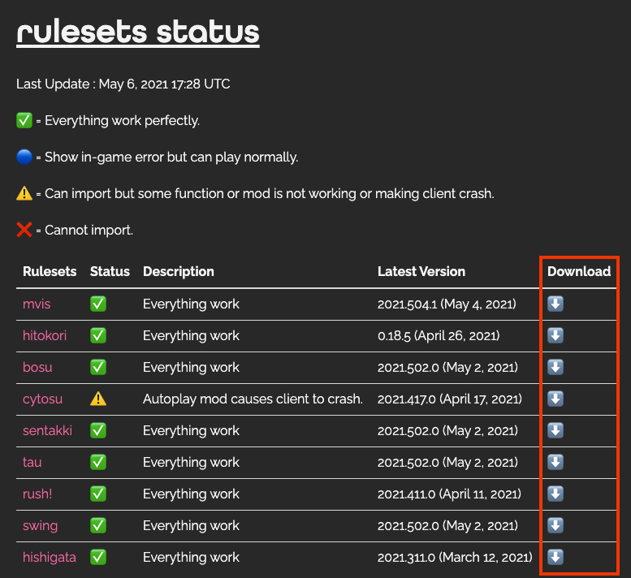
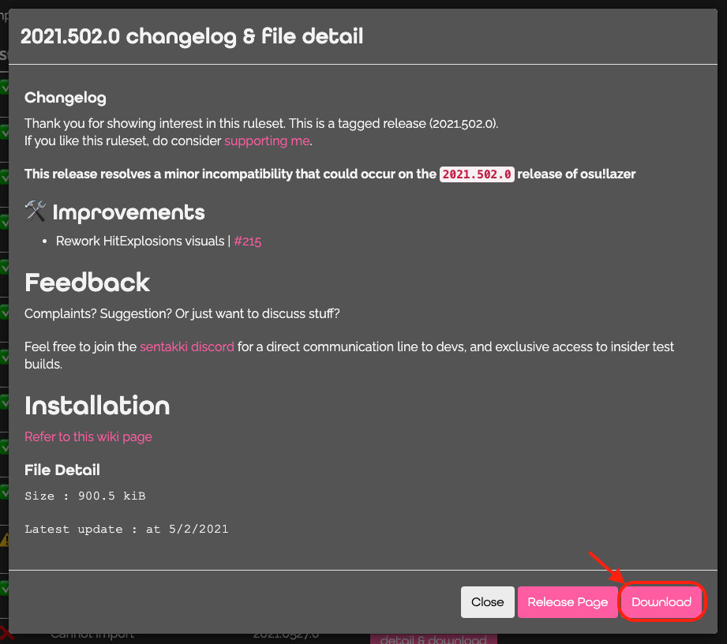
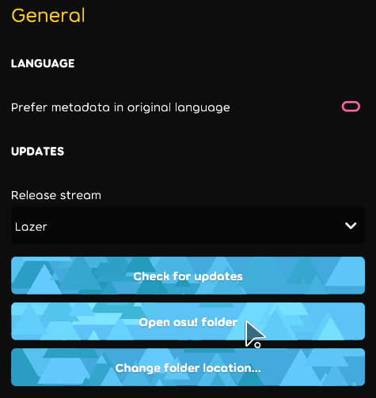

# download rulesets file

Go to ruleset's repositories release page or go to [rulesets status page](https://rulesets.info/pages/status) and press download button to go to ruleset's repositories release page.

Then, download a ruleset file by press on `.dll` file in release list.

# import rulesets to osu!lazer

### Step 1 : Navigate to osu! data directory

Open the setting menu in osu!, in `General` part there would be a button to `Open osu! folder`. On windows you could navigate to the data folder directly via Windows Explorer, by default this location is `%AppData%/osu!/rulesets`. On MacOS default this location is in application itself.

### Step 2: Installing the ruleset

Copy the ruleset file (.dll file that you just download) into the rulesets directory, do make sure that duplicate copies of the ruleset is overwritten.

Other rulesets also could share the same folder.

### Stpe 3: Have fun!

After completing the above steps. If you already open osu!lazer during install you may need to restart osu!lazer. Once osu!lazer is started, you should see the ruleset alongside the standard rulesets.

# update rulesets

To update rulesets, just do the same step and overwrite the old rulesets file.