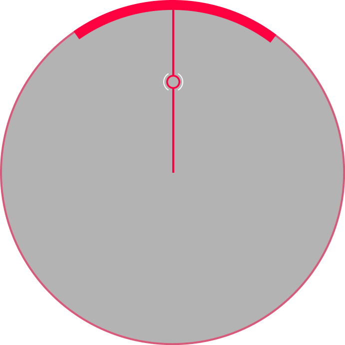
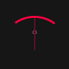
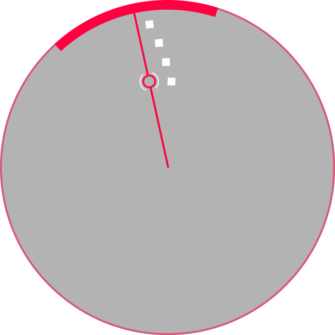
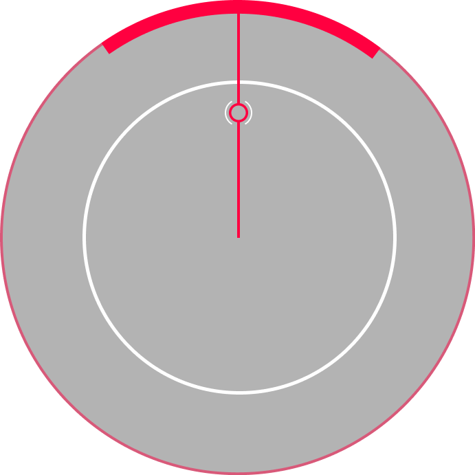
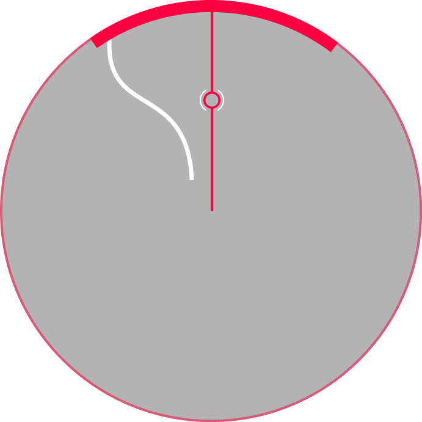
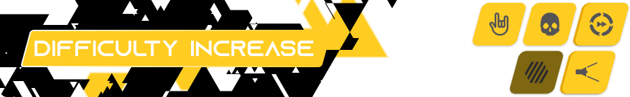
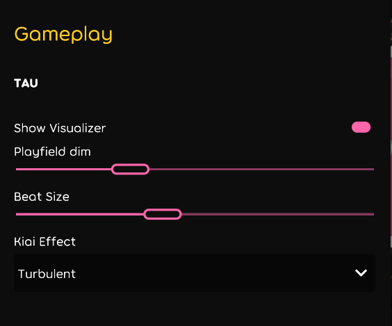

# status

- Status : Active development
- Last Update : 2021.416.0
- Can import and play without error : Yes

# overview

- Creator : [Laica](https://github.com/Altenhh)
- Availability : Available Publicly
- GitHub Repositories : [Altenhh/tau](https://github.com/Altenhh/tau/)
- Discord : [tau](https://discord.com/invite/7Y8GXAa)

Tau is a custom ruleset with a circle surrounding a paddle and some notes.

 *The idea is based on [pizzazip's Tau](https://deadlysprinklez.itch.io/tau). The ruleset is developed by [Laica](https://github.com/Altenhh).*

# gameplay

Tau's gameplay revolves around a paddle which is moved around a circle. In the circle, there are different types of notes trying to escape it. The player has to move the paddle to block these notes, then hit them using keyboard keys according to what button each noter requires.

The gameplay playfield looks like the following:

This is an empty playfield, the parts it contains are:

  1.  The Cursor
  
  This is your mouse, it shows you where on the screen your mouse currently is.
    
  *The closer the cursor is to the centre of the screen the faster your paddle moves, the further away the cursor is from the centre of the playfield the slower your paddle moves (Because the circle you move your mouse in becomes smaller/bigger) keep this in mind while playing as it makes it easier to play and switch in between higher sensitivity and lower sensitivity when needed*

  2. The Paddle 
 
  You move it by moving your mouse and cursor, you use it to hit the notes and not let them escape your grasp.

  *You should always move it to the place the next note you are gonna hit is heading and keep it there until the note intersects the paddle and by pressing the button required for that note you maximize the score it can give.*

# note types

> Source: [Tau note types wiki](https://github.com/Altenhh/tau/wiki/Note-types).

## Beats

These notes will appear from the centre and move towards the ring. Move the paddle to the place they are going towards and hit them as they intersect the ring to maximize score.

*You can hit "Beats" using the mouse left and right buttons or using the Z and X buttons in your keyboard.*

*And you can easily customize that keybind to another key in the settings of osu!*


| Judgement | Score Value | Accuracy |
| --------- | ----------- | -------- |
| Miss      | 0           | 0%       |
| Good      | 200         | 33.66%   |
| Great     | 300         | 100%     |


## HardBeats

These notes will appear from the centre and move towards the ring. They look like a giant circle heading towards the outer ring. Hit them as the head intersects the ring, You can hit "HardBeats" wherever your paddle is on the ring so you do not need to aim for them however the button on the keyboard that you press to hit them with is different from all other note types.

*You can hit "HardBeats" using the Space bar button in your keybaord.*

*And you can easily customize that keybind to another key in the settings of osu!* 


| Judgement | Score Value | Accuracy |
| --------- | ----------- | -------- |
| Miss      | 0           | 0%       |
| Good      | 200         | 66.66%   |
| Great     | 300         | 100%     |


## Sliders

These notes will appear from the centre and move towards the ring. They look like a long line that you will have to follow it wherever it goes. Tap them as the head intersects the ring, then follow the body with your paddle and release the note when the tail reaches the ring.

*You can hit "Sliders" using the mouse left and right buttons or using the Z and X buttons in your keyboard.*

*And you can easily customize that keybind to another key in the settings of osu!*


| Judgement | Score Value | Accuracy |
| --------- | ----------- | -------- |
| Miss      | 0           | 0%       |
| Good      | 200         | 66.66%   |
| Great     | 300         | 100%     |


# controls

Tau can be played on tablet or mouse with keyboard. Use the pointer to move the paddle and use the keyboard to hit the notes accordingly.

### default controls

- Left Tick Button - `Z` `M1`
- Right Tick Button - `X` `M2`
- Hard Beats Button - `SPACE`

# mods

> Source: [Tau gameplay mods wiki](https://github.com/Altenhh/tau/wiki/Gameplay-mods).

## difficulty reduction

-  Easy
  - Larger hit area, more forgiving HP drain, less acuracy required, and three lives!
    - Make a game easier by increase paddle size, less HP drain, less acuracy required and 3x of max health.
  - Score Multiplier: 0.50x

-  No Fail
  - You can't fail, no matter what.
    - Makes it impossible to fail.
  - Score Multiplier: 0.50x

-  Half Time
  - Less Zoom...
    - Decreases speed .75x.
  - Score Multiplier: 0.30x
  - Click the icon again for *Daycore Mod* : Whoaaaaa...

## difficulty increase

-  Hard Rock
  - Everything just got a bit harder...
  - Score Multiplier: 1.06x

-  Sudden Death
  - Miss and fail.
    - If you miss, you fail.

-  Double Time
  - Zoooooooooom...
    - Increased speed 1.50x.
  - Score Multiplier: 1.12x
  - Click the icon again for `Nightcore Mod` : Uguuuuuuuu...
    - Increases speed by 1.50x and raises audio pitch.

-  Flashlight
  - Restricted view area
    - You can only see the area around the pointer.
  - Score Multiplier: 1.12x
  - Click the icon again for `Blinds Mod` : Play with blinds on your screen
    - Two doors on the playfield will make it to where you cannot see the note when your HP is high.

## automation

-  Autoplay
  - Watch a perfect automated play through the song.

-  Relax
  - You don't need to click. Give your clicking/tapping fingers a break from the heat of things.
    - Just move a paddle.

## conversion

-  Difficulty Adjust
  - Override a beatmap's difficulty settings.
  - You can override *HP Drain*, *Accuracy*, *Paddle Size*, *Approach Rate* and *Extended Limits*

## fun

-  Wind Up
  - Can you keep up?
    - Slowly increases speed from 1.00x to 1.50x throughout the map and raises the pitch alongside the speed.
  - The song speed will be getting faster and faster
  - Click the icon again for `Wind Down Mod` : Slooow doooown...
    - Slowly decreases speed from 1.00x to 0.75x throughout the map and lowers the pitch alongside the speed.

# settings

Tau has a few options to customize your experience while playing this gamemode, you may have even stumbled upon this section within the option menus.

This page will serve as a kind of reference to what each customization option does, and to allow you to find the perfect setup.

## Show Visualizer

This option allows users to disable the visualizer that shows up around the ring during the gameplay at times.

## Playfield dim

This adjusts the background dim inside the playfield (Inside the ring).

*Basically putting it to a hundred makes it pitch black and putting it to 0 makes it go the same dim you have in osu!'s original settings.*

## Beat Size

This adjusts the size of "Beats" notes to make them smaller in size or bigger based on the player's best interest

## Kiai Effect
This options allows you to choose in between 3 different Kiai effects (the particles that show up in gameplay alongside the visualizer) and you will be able to choose in between the following three options:

  1. *Turbulent:* This is the default option, and it allows the particles to roam freely in the air of the screen and roam in it.
  2. *Classic:* This is the old classic version of the kiai effects, and it has a certain locked pattern where the particles are restrained.
  3. *Disabled:* This option disables the particles entirely.

*If you change the settings and you do not know how to restore it to the default just press the orange button that shows up near the setting.*

# demo


